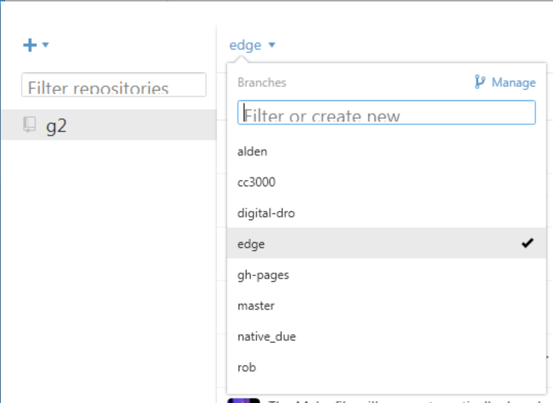
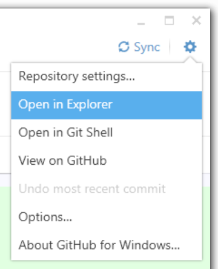
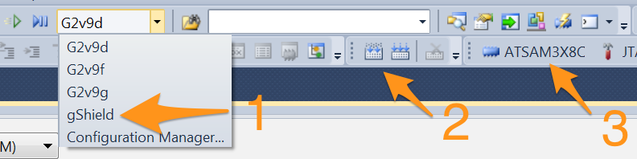

_This page is for compiling the g2 project on Windows 10 with Atmel Studio 7_

## What's needed

#### VMWare Virtual Machine on OSX or Linux
These instructions apply if you are running a VMware virtual machine on OSX or Linux. If you are on a native Windows system or running another VM you can skip these
* Set up the virtual machine with at least 4 GBytes of RAM and 30+ GB of hard drive allocated in 2 Gb chunks
* When asked for integrated / isolated it's best to chose integrated so you can share files across filesystems. This way you can use native OSX or linux tools for git and other functions.
* It's advisable to snapshot the VM before installing so you can recover from errors w/o burning through Windows activations. You can delete the snapshot later to recover that space.
* Some VMware voodoo that can be useful
  * https://communities.vmware.com/thread/419693
  * Enable sharing in order to mount an OSX drive. This is usually your Home directory and shows up as Z:
* There are some [issues with Windows 10 and VMware 8](Windows-10-VMware-Fusion-8-Issues) that may or may not have been resolved. In any case, you need to get VMware tools recognizing the Z: drive or AS7 will not compile - as it cannot use UNC paths.

#### Disk Space
Atmel Studio 7 weighs in at a portly 2.01 Gb, so you need this much space on your C: drive (virtual or otherwise). The g2 project itself downloads the entire tool chain (in g2/Motate/Tools/win32) so it's also pretty big - currently almost 800Mb. You should have at least 1 Gb free on your Z: drive if you are installing it there.

#### Atmel Studio 7
To compile G2 on Windows with Atmel Studio you will need the Atmel Studio 7 build 1006 (or greater), Service Pack 1 Installer – with .NET. We recommend a clean machine or VM.

* Go to Atmel and download the [Atmel Studio 7 Installer – with .NET](http://www.atmel.com/tools/atmelstudio.aspx) install package.
  * Be sure to get the one with the **.NET part** (about 800 Mbytes) unless you are sure you already have the .net revision that AS needs (Framework 4).
  * There may also be USB driver updates that are not in the main file. If so, you might want these as well. You should not need any of the Part Packs or other files.
  * They require you to either register or fill out a "guest" form. Otherwise it's free.

* Walk through the entire installation process. 
  * It should install .NET, Microsoft Studio, Atmel Drivers, Atmel Studio
  * Fire up AS7 for the first time 
    * You **do not** want the Atmel Solutions Framework (ASF) when asked. So don't update it and turn of notifications. Do NOT use an ASF project (like the Arduino Due board) if you are playing with AS6 or you will have a lot of stuff to back out.
    * You **will** need the USB drivers when asked.

#### Git for Windows
The project Makefiles rely on Git for Windows, so even if you use Git on your native OS for all your other activities it needs to be installed in your Windows environment.
* Go to the [official Git site](http://git-scm.com/downloads) and download and install the Git for Windows. Get the right one for your VM - 32 bit or 64 bit (version 2.9.3 at the time of this writing).
  * Option Dialog 1: Chose BASH (default, but any should work)
  * Option Dialog 2: Chose option 2, Checkout as-is, Unix style line endings 
  * Option Dialog 3: Chose MinTTY (default, but  doesn't matter for our uses)
  * Option Dialog 4: Both boxes checked ON, but turn OFF if windows weirdness (works for us)
  * when it asks you if you want icons on your desktop you might want this to get Git Bash so you can debug the Windows environment (should it come to that)

#### Cloning the Git Repository
There is more than one way to clone the Git repository. 
- Direct clone in a terminal window
- Use Github Windows app

##### Cloning the Git Repository - Direct Clone
If you already have Git on your host machine (i.e. you are on Windows and already have git credentials or are running a VMWare Windows instance and have git credentials on the host) you can simply do a git clone. We use the ssh form as in our experience it's more troublefree than the http form. Open a terminal window and navigate to the parent directory in which you want to install the `g2` github repo. Type:

      git clone git@github.com:synthetos/g2.git
      git submodule update --init
      git config fetch.recurseSubmodules on-demand

That should do it.

##### Cloning the Git Repository - Github Windows App
the GitHub Windows app is an easy way on Windows.

  1. Download and install the [GitHub app](https://windows.github.com/).
  2. Log into the GitHub web site -- register if needed, it's free.
  3. Browse to the [G2 project page](https://github.com/synthetos/g2) and then click on the `Clone in Desktop` button.
  * The GitHub application should open up, and ask where to save the new repository. The default location will probably be sufficient.
  4. In the GitHub app, click on the unnamed menu in the top-left and then click on `edge` to checkout the edge branch.<br/>

  5. From the gear menu in the top-right of the Github window choose "Open in Git Shell" to start a terminal session.<br/>
    1. In the terminal that appears, run the following command:

      ```bash
      git submodule update --init
      git config fetch.recurseSubmodules on-demand
      ```

  6. (Convenience) From the gear menu in the top-right of the Github window choose "Open in Explorer" to show the location of the newly checked-out repo.<br/>


#### Compiling and uploading with Atmel ICE
_Note:_ Many of these instructions will work with the Atmel SAM-ICE as well.

In the project directory all of the source files and the Atmel project files for Studio 6 are inside the `TinyG2` directory. Once Atmel Studio 6.2 is installed, open the solution file `TinyG2.atsln`. (Atmel studio will also open the project file `TinyG2.cppproj` automatically.)

_Note:_ Git is configured to ignore the changes to some of the project's dependent files so that they don't cause havoc. This means that to commit changes to those files, they need to specifically be added to the commit by name.

To compile the project:



1. Choose the platform you are building for (for the Due with gShield pinout, choose `gShield`).
2. Click either the "Build Project" or "Build Solution" buttons -- they are the same in this case. (These can also be found in the Build menu.)
  * This will create a file named `TinyG2.elf` and another named `TinyG2.bin`, both in the `TinyG2` folder.
  * You will need one of these files to upload to the board. With option 5, below, it will use this file automatically. All other ways of uploading to the board will require you to locate this file manually.
3. Configure the Device and Atmel-ICE Tool in the TinyG project Properties window, which can be found by right clicking the TinyG2 root directory in the Solution Explorer pane.
  * In the Device tab select one of: `ATSAM3X8C` for a v9 board, or `ATSAM3X8E` for the Due
  * In the Tool tab select your `Atmel-ICE`, which must be plugged in for it to appear. If you have more than one plugged in you can identify them by the last 4 digits of the serial number.
  * The Interface must be `SWD`. JTAG doesn't work.
  * You can now program and debug the buttons labeled '5' in the picture, as per step 5, below.
4. (Alternately) Connect, configure and test the Atmel-ICE Tool in the Device Programming window: 
  * The Tool should be Atmel-ICE. If you have more than one connected identify by the last 4 digits of the serial number.
  * The Device is one of: `ATSAM3X8C` for a v9 board, or `ATSAM3X8E` for the Due
  * The Interface must be `SWD`. JTAG doesn't work.
  * Hit Apply
  * You can hit Read the Device Signature to verify that you are connected. Or just hit the Memories tab
  * Program from the Memories tab. Make sure the file selected is the TinyG2.elf in the main TinyG2 directory. You can also use this option to program _any_ binary (particularly useful if you didn't compile it).
5. To compile and upload without debugging (left) or with debugging (right) click one of these two buttons. These are also available from the Debug menu.

## Uploading G2 to a target board (without a Atmel ICE)

To flash G2 (using the TinyG2.bin file you just made in step 2 above) onto a target board _without_ using a debugger such as the Atmel ICE or Atmel SAM-ICE, please visit the [[Flashing G2 with Windows]] page.

##Troubleshooting Windows Configurations

The following tags are used. They can apply to the problem, and also the possible solutions:
  - [w32], [w64]: This problem affects Windows32 / Windows64 configurations
  - [w7], [w8]: This problem affects Windows7 / Windows8 configurations
  - [all]: This problem affects all configurations (that we know of)

These are things we have seen fail. Please feel free to add to this list if you find issues that have solutions.

#### **Problem**: Zips don't extract [w32]

  - You get this error:

  ```bash
  mkdir -p win32 && \
  cd win32 && \
  ../7za/7za x -ogcc-arm-none-eabi "gcc-arm-none-eabi-4_9-2015q2-20150609-win32.zip"
  /usr/bin/sh: ../7za/7za: Invalid argument
  ```

  - **Solution** - Only one copy of AS6 can be open. CLose all copies of AS6, restart ONE, and run the build again.

It's actually really easy to get more than one instance of AS6 running. When you click on it sometimes there is no feedback that the click was received. Then some 15 - 30 seconds later you might see some indication. But usually by that time you have clicked it again, thinking that you must of mis-clicked the first time. Voila. 2 instances.

#### **Problem**: Git is not found [w32] [w64]

   - Git is not installed in your windows instance. Instructions for installation is above in the [What's Needed](https://github.com/synthetos/g2_private/wiki/MIRRORED:Compiling-G2-on-Windows-(Atmel-Studio-6.2)#whats-needed).
