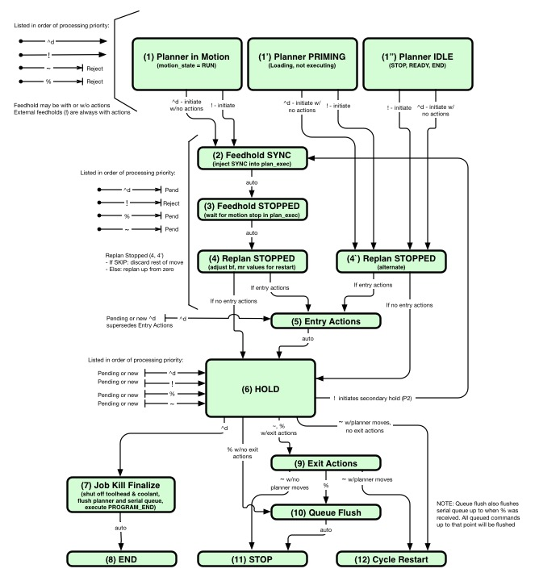

## Feedhold Overview

Char | Command | AKA | Description
----------|---------|-----|-------------
! | Feedhold | Pause | Stop movement immediately. Maintains positional accuracy
~ | Cycle Start | Resume | Resume movement from hold point (where motion stopped)
% | Queue Flush | | Exit feedhold while deleting remaining moves from planner buffer
^d | Job Kill | End Program | Kill job from inside or outside feedhold

To pause motion send a feedhold character (`!`) character during motion. Movement will decelerate to a stop while maintaining positional accuracy. To resume motion send a cycle start tilde character (`~`).

If you wish to not perform the remainder of the move after the feedhold send a queue flush character (`%`) after the feedhold character. Motion will start with the next Gcode command entered. A cycle start is not necessary after a queue flush. Flush is primarily used by internal functions, and can be useful as part of a jogging operation.

## Changes to Feedhold in firmware build 101.00 and Later
As of `{fb:101.00}` feedhold supports feedhold entry and exit actions and supports "in-hold" actions. 
* **Entry Actions**: Z lift, spindle pause, coolant pause
* **Exit Actions**: Coolant restore, spindle restore (w/spin-up delay), return to hold point, resume operation
* **In-Hold Actions**: Tool movement, homing, probing

### Entering Feedhold
To request a feedhold issue a bang `!`. If the tool is in motion a feedhold will be initiated. If the tool is not in motion feedhold requests are ignored. The following actions occur in sequence if feedhold is executed.

1. **Start Hold**: The tool is stopped as quickly as possible without losing position. Feedhold deceleration starts within 5ms of the `!` and decelerates at a rate determined by the resultant jerk value for the participating axes. The deceleration may span multiple Gcode moves if the braking distance requires. The final position where the tool stops is the "hold point".

1. **Save Hold Point**: Once the machine has stopped the hold point is saved using G30. _Note: Previous values of G30 will not be restored - this restriction may be lifted in a later release._

1. **Z lift**: If the Z lift `{zl:nnn}` setting is non-zero the Z axis will move the distance specified in `nnn`. By convention, positive Z values move away from the work, but ZL can be positive or negative as machine setup requires.

1. **Spindle Pause**: If Spindle Pause On Hold `{spph:t}` is true a running spindle will be turned OFF when entering feedhold after the Z motion is completed. If `{spph:f}` is false the spindle state is unaffected.

1. **Coolant Pause**: If Coolant Pause On Hold `{coph:t}` is true mist and/or flood coolants will be turned OFF when entering feedhold after the Z motion and spindle operation are completed. If `{coph:f}` is false the coolant state is unaffected.

1. **In Hold State**: Once the above actions have completed the machine is in a hold state. At this point the machine is operating in the "secondary planner" aka p2. From this point on changes to machine state do not affect the primary planner, the state of which will be restored once feedhold exit is complete (it's like a virtual machine). See In-Hold Operations for description of commands supported in p2. 

### Exiting Feedhold
Once in a hold state the following commands will exit a hold: Exit `~`, Flush `%`, or Kill Job `^d`. These commands will not interrupt feedhold entry or exit actions from executing (Z lift, returns, etc.), but will interrupt any in-hold movements if they are being run.

* **Exit**: If `~` is received the hold is exited with the exit actions described below. The machine is restored to its prior state; including offsets, feedrates, and other Gcode modal values. The exception is tool offsets, 
which are are not reverted should they have been changed during the feedhold. Motion will continue from the hold point.

* **Flush**: If `%` is received the hold is exited with the exit actions described below. State is restored as with `~`, but pending motion commands are flushed from the hold point. The tool will not move until new commands are received.

* **Kill Job**: If Control-d `^d` is received the job is abandoned immediately. No exit actions occur. The following actions occur:
  * Machine is restored to the state of the primary planner, including current position of tool
  * Coolant and spindle are stopped
  * Runs an M30 (PROGRAM_END), which restores Gcode defaults
  * An exception report and status report are sent

#### Exit Actions
1. **Coolant Restore**: If Coolant Pause On Hold `{coph:t}` is true mist and flood coolants are returned to their state prior to the feedhold. (If they were ON they are restored, if they were OFF they are not.) If `{coph:f}` is false the coolant state is unaffected. Coolant may be turned ON and OFF while in a feedhold. If `{coph:t}` is true these settings are overridden and the coolants are returned to their prior states. If `{coph:f}` is false the new coolant states will still be in effect after the feedhold is exited.

1. **Spindle Restore**: If Spindle Pause On Hold `{spph:t}` is true the spindle is returned to its state prior to the feedhold. If `{spph:f}` is false the spindle is unaffected. The spindle may be turned ON and OFF and speed changed while in a feedhold, but if `{spph:t}` is true the spindle will be returned to its state and speed prior to the feedhold. If `{spph:f}` is false the spindle changes during the feedhold will still be in effect after the feedhold is exited. If Spindle Delay `{spde:nnn}` is non-zero a wait of `nnn` seconds will follow the spindle resume prior to the return move.

1. **Return to Hold Point**: Following coolant and spindle operations the toolhead is returned to the hold point. If a Z lift was applied (and no other in-hold motion occurred) the Z return is executed. If in-hold motion occurred, the return move will move first in XYABC, then in Z to return to the hold point. Note that new or changed tool offsets are not observed or corrected in the return move - the toolhead itself will return to its exact prior location (not the tool tip).

### In-Hold Operations

When a feedhold is in effect the machine can execute moves and other operations "inside" the feedhold by wrapping gcode in a `{gc2:"..."}` JSON object, making it possible to move and jog the tool in p2. The following operations are supported while in feedhold (i.e. in the secondary planner, p2).

- **Gcode commands**: Gcodes and M codes can be presented to the secondary planner if wrapped in a `{gc2:"..."}` object. For example, `{"gc2":"G90 G0 X1.875"}` would move 1.875 units in X as relative motion. Spindle, coolant and other commands may be delivered this way as well. _Note: Other forms of Gcode such as queue `{gc:"..."}` or raw Gcode should not be presented while in hold._

- **Feedhold in secondary planner**: A `!` received while in p2 performs these actions:
  - Stop motion in p2 as per usual for a feedhold
  - Flush all commands in p2 planner queue
  - Return p2 to an idle state ready for the next command 
  - _Note: `~`, `%` and `^d` are not used by p2, and if presented will exit the primary feedhold as described in Exiting Feedhold, above_

- **Homing**: A homing operation may be performed while in p2. The new home location will reset the machine's home location and absolute coordinate system. The return move will return to the same coordinates as the hold, but if the home location was moved the return coordinates will also shift by the same amount.

- **Probing**: G38.x probing can be performed while in p2.

## Job Kill
If Control-d `^d` is received the job is abandoned immediately. The following actions occur:
  * Machine is restored to the state of the primary planner, including current position of tool
  * Coolant and spindle are stopped
  * Runs an M30 (PROGRAM_END), which restores Gcode defaults
  * An exception report and status report are sent

## Jogging Using Feedhold and Queue Flush
To jog using feedhold and queue flush do the following:
* Start the jog by issuing a move in the jogging direction at the velocity you want for the jog
* Send a ! when the user wants the jog to stop
* Send a % to flush the remainder of the move. These should each beon their own line, but can be sent together in a single transmission: `"!\n%\n"`

Nudge moves to fine-tune the jog can be performed by issuing short Gcode moves such as `G91 G1 F100 X0.001`

Remember to set the system back to absolute mode by issuing a `G90`.

## Design Notes
These are not needed for operation, but are included for completeness.

### Definitions
**Definition** | **Description**
---------------|-------------------
`!` | feedhold request
`~` | cycle start request
`%` | queue flush request
`^d` | job kill request
entry actions | Perform feedhold Z lift, pause spindle if running, pause coolant(s) if running
exit actions | Resume coolant(s) if paused, resume spindle if paused, delay spindle, perform Z return 
in cycle / not in cycle | Machine is executing Gcode commands --> cycle_type != CYCLE_NONE
in motion / not in motion | Machine is moving --> motion_state == MOTION_RUN
planner is empty | Planner queue has no buffered commands
planner not empty | Planner queue has buffered commands (but maybe no motion commands)
planner has motion | Planner queue has buffered commands including motion commands
planner is priming | Planner has one or more commands but has not started execution
in-hold commands | feedholds will execute Gcode wrapped in `{"gc2":"gcode"}` JSON
buffered gcode | feedholds buffer non-JSON Gcode at serial IO for processing after hold released
__________________________|

### Feedhold and Job Kill state Model

