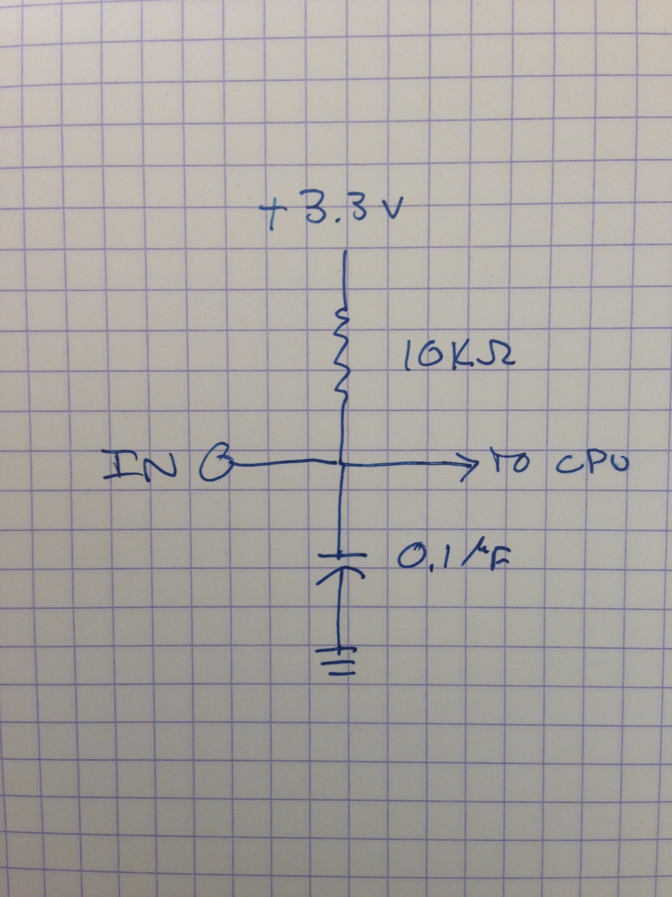

*** **Note: In the middle of editing - Feb 14, 2016** ***
_This page describes homing operation cycles for version 0.98 and later versions._

#Homing Commands and Operation
##Overview
The term "homing" in this context means setting the absolute machine coordinates to a known zero location, or _zeroing the machine_. 

The absolute machine coordinate system (aka "absolute coordinate system", "machine coordinate system", or "G53 coordinate system") is the reference coordinate system for the machine. Work coordinate systems G54, G55, G56, G57, G58, G59 can be defined on top of G53 as offsets to the machine coordinates, and G92 can be used to put offsets on the offsets. Yes. It gets confusing. The [coordinate systems](Coordinate-Systems) page may help.

Homing is typically performed by running a "homing cycle" that locates the Z **maximum**, X minimum, and Y minimum limits - in that order. In CNC machines Z is often set to zero at the top of travel, with all moves towards the work surface (bed) being negative. X zero is located in the left hand corner with positive travel to the right, and Y zero at the front of the machine with positive travel to the rear. Once machine zero is set work zero can be set to the middle of the table of any other location using the coordinate offsets. It's common practice to leave G54 in the homed machine coordinates and G55 used for a "centered" coordinate system.

Z is homed first so that X and Y moves will clear any obstacles that might be on the work surface. Other machine configurations may be set up for different min and max, may or may not include all axes, or may set an axis to an arbitrary coordinate location (see G28.3).

### How does homing work?
Homing is invoked using a G28.2 command with one or more axes specified in the command: e.g. `g28.2 x0 y0 z0`. Homing is always run in the following order `Z,X,Y,A,B,C` for each axis present in the g28.2 command. Axes not present are ignored and their zero values are not changed.

To enable and configure homing for an axis:

* Each input must be configured properly. See [Configuring Digital Inputs for Homing](Configuring-Digital-Inputs-for-Homing)
* The homing input must be set for the axis `{xhi:_}` 
* The homing direction must be set for the axis `{xhd:_}` 
* The other axis configurations must be set up for homing. See [Configuring Axes for Homing](Configuring-Axes–for-Homing) 

After initialization the following sequence is run:

1. Mark the machine as unhomed: `{home:0}`
1. Mark all axes as unhomed: `{homx:0}`, `{homy:0}`, `{homz:0}`...
1. Disable limits. Shutdown and safety interlocks are not disabled
1. Run a series of internal tests to detect input, axis or other mis-configuration
  1. Fail if misconfiguration detected - returns [status code](Status-Codes) 240 and up
1. Run homing for each selected axis in ZXYABC sequence:
  1. If a homing input is active on start, back off the input switch by latch backoff distance `_lb`
    1. Fail homing if switch is closed and inputs are shared
  1. Search towards homing switch in the `_hd` direction at `_sv` search velocity until switch is hit. Stop motion using the `_jh` jerk setting (high jerk setting)
    1. Fail if the switch is not hit within the search distance (~`_tm` - `_tn`)
  1. Drive away from the homing switch at `_sv` search velocity for latch backoff distance `_lb`
  1. Drive back towards homing switch at latch velocity `_lv` until switch is hit
  1. Back off switch by the zero backoff distance `_zb` and set zero for that axis
  1. Mark the axis as having been homed, e.g. `{homz:1}`
1. Perform homing for the next enabled axis in the sequence
1. If all axes homed successfully mark the machine as homed: `{home:1}`

Note: If you need to home unswitched axes using g28.3 do this after the g28.2 operation to set proper homing state. For example, a roll-feed Y axis on a paper cutter might be homed as:

<pre>
  G28.2 X0 Z0
  G28.3 Y0
</pre>

###Homing Cycles
In TinyG homing is performed by running a `G28.2 X0 Y0 Z0` command (The 0's are not used and any number will do, but the X Y and Z words must have some arbitrary value). 

g2 homing uses these non-standard Gcode functions: 

	Gcode | Parameters | Command | Description
	------|------------|---------|-------------
	G28.2 | _axes_ | Homing Sequence | Homes all axes present in command. At least one axis letter must be present. The value (number) must be provided but is ignored.
	G28.3 | _axes_ | Set Position | Set machine origins for axes specified. In this case the values are meaningful. This command is useful for zeroing in cases where axes cannot otherwise be homed (e.g. no switches, infinite axis, etc.)

Constraints:
* The homing sequence is fixed and always starts with the Z axis (if requested). The sequence runs ZXYABC, but skipping all axes that are not specified in the G28.2 command. Attempting to home an axis that is not configured will result in an error.
* **Homing operations (G28.2 and G28.3) must not be performed during Gcode jobs**. The machine must be idle, with no queued commands before performing either operation.

Note: In high-end CNC machines there is often no user-accessible homing cycle as machine zero is set at the factory and does not need to be set by the end user. See [Peter Smid's CNC Programming Handbook, version 2](http://books.google.com/books?id=JNnQ8r5merMC&lpg=PA444&ots=PYOFKP-WtL&dq=Smid%20version3&pg=PA447#v=onepage&q=Smid%20version3&f=false) for details. 

## Switches
### Switch Inputs
A g2 firmware build has an arbitrary number of digital input pins that may be used for homing. On the v9 there are 9 digital inputs. Arduino Due based g2 builds may be configured to have many more. 

The inputs are 3.3v logic inputs and **must not have 5v applied to them or you will burn out the inputs**. Optical inputs can also be used providing the swing between 0 and 3.3 volts.

Inputs are sensitive to the leading edge of the transition – so falling edge for NO and rising for NC. As a de-glitching mechanism when an input triggers it enters a lockout state for a brief period (typically ~50 ms) where it will not trigger again.

Additionally, on the TinyG v9 and some other boards these inputs are electrically de-glitched with a resistor-capacitor pair and also transient protected for electrostatic discharge. The RC circuit performs a pull-up of the signal and prevents spurious noise from getting into the line. If you are using a Due-based g2 or some other config we recommend using this circuit or something like it:

### Switch Wiring
Mount a switch for each axis that will be homed and connect to an input. To connect a switch to an input pin simply wire the switch across the ground and the input. Each input may be selected for NO or NC independently. We recommend using NC switches for better noise immunity to prevent false firings. 

While it is possible to share an input with two or more switches it is preferable to have a unique input for each homing axis. A shared input will not allow the homing routine to automatically back off a homing switch that is closed at the start of the homing cycle. If inputs are shared and a switch is closed at the start of a cycle homing will throw an error instead of just backing off the closed switch and continuing.

The following configuration is typical for most milling machines and 3D printers:

	Pin  | Function    | Position on machine
	-----|-------------|-------------------------
	Xmin | X homing switch | on the left of the machine
	Ymin | Y homing switch | at the front of the machine
	Zmax | Z homing switch | at the top of the Z axis travel

####Limit Switches
Having wired the homing inputs, those same switches can also be used as limit switches, as can any other inputs. Limit switches also share an input, but provide better alarm messages if they are independent. Adding limit switches would add these three switches to the example above:

	Pin  | Function    | Position on machine
	-----|-------------|-------------------------
	Xmin | X min limit switch | on the right of the machine
	Xmax | X max limit switch | on the left of the machine
	Ymin | Y min limit switch | at the front of the machine
	Ymax | Y max limit switch | at the back of the machine
	Zmax | Z max limit switch | at the top of Z axis travel

## Configuring Homing
It is mandatory that the homing configuration settings match the physical switch configuration otherwise homing simply won't work. In the case of NC switches the entire machine may be rendered inoperative if these settings are not in alignment. Homing is set up by first configuring the digital inputs, then configuring each homing axis to use the proper input. 

### Configuring Digital Inputs for Homing
Digital inputs are explained on the [GPIO page](Digital-IO-(GPIO)) but are recapped here (using di1 as an example):

	Name | Description | Values
	------|------------|---------
	{di1mo:_} | input mode |-1=disabled, 0=active low (NO), 1=active high (NC)
	{di1ac:_} | input action | 0=none, 1=stop, 2=fast_stop, 3=halt, 4=reset
	{di1fn:_} | input function | 0=none, 1=limit, 2=interlock, 3=shutdown, 4=panic

For homing we recommend using "active high" (1) switches. The action and function settings are not used for homing, and can be set to "none" (0).

### Configuring Axes for Homing 
Setting up an axis for homing is done as so (using the X axis as an example):

	Setting | Description | Notes
	--------|-------------|--------------
	{xtn:_} | Travel Minimum | Minimum travel in absolute coordinates 
	{xtm:_} | Travel Maximum | Maximum travel in absolute coordinates 
	{xjh:_} | Jerk High | Jerk value used during homing operations
	{xhi:_} | Homing Input | Switch (input) to use for homing this axis
	{xhd:_} | Homing Direction | 0=search-towards-negative, 1=search-torwards-positive
	{xsv:_} | Search Velocity | Homing speed during search phase (drive to switch)
	{xlv:_} | Latch Velocity | Homing speed during latch phase (drive off switch)
	{xlb:_} | Latch Backoff | Maximum distance to back off switch during latch phase (drive off switch)
	{xzb:_} | Zero Backoff | Offset from switch for zero in absolute coordinates

* **xtn/xtm** - Travel Minimum and Travel Maximum. XTM - XTN is used to set the search distance before homing gives up. This is to prevent the machine from grinding away indefinitely if a homing switch is not found or is mis-configured. If the distance is too short to reach the switch homing will return a false result based on where the axis stopped. Travel minimum and maximum must add to a non-zero total travel or an error will be thrown.

* **xjh** - Jerk High - Sets the jerk value used to stop movement when switches are hit or released. You generally want this as fast as you can get it without losing steps on the accelerations. It should be at least as large as `xjm`.

* **xhi** - Homing Input - Selects which input is used to home this axis.

* **xhd** - Homing Direction - Set to 0 to search towards the minimum, 1 to search towards maximum. 

* **xsv** - Search Velocity - Speed of search. Set this high enough that the search does not take excessively long, but not so high that the machine cannot decelerate within the throw of the switch. The deceleration distance will be a combination of the search velocity and the high jerk value (xjh). A higher jerk will decelerate to zero in less distance. Set a moderate pace, e.g. 1/4 to 1/2 the max velocity. Search velocity must be a positive, non-zero number. 

* **xlv** - Latch Velocity - Homing speed during latch phase (drive off switch). Set low enough to have repeatable switch closure, e.g. 100 mm/min or lower. Movements at latch velocity can be kept short by setting latch backoff appropriately. Latch velocity must be a positive, non-zero number.

* **xlb** - Latch Backoff - Maximum distance to back off switch during latch phase (drive off switch). This value must be set large enough to reliably clear any switch closure for this axis or you will see frustrating errors. Typically a couple of mm is OK, but more may be required for switches with long throws or some optical switches.  Latch backoff must be a positive number or zero.

* **xzb** - Zero backoff - Offset from switch for zero in absolute coordinates. This determines how far away from the switch the actual zero will be set. Usually no more than a few millimeters.

**Note:** Min and max travel are used for two functions (1) setting [soft limit](Homing-and-Limits-Setup-and-Troubleshooting#soft-limits) boundaries, and (2) they are added together to determine the total travel that an axis can move in a homing operation. Typically min is set to zero and max is something (e.g. 280mm). For soft limits it can be useful to set set Z max = 0 and Zmin = -something. If these values are misconfigured the search could stop before it reaches the intended switch, and the homing operation is canceled.

### Configuration Example
Here is an example of the JSON for setting up a Shapeoko2, dual Y axis, with a 500mm work surface. X is homed to minimum (right side of machine), Y to minimum (front of machine). Z is homed to maximum (top of Z travel). X, Y and Z homing switches are  also used as limit switches, and X and Y have additional limit switches on their maximums.

It is important to configure all inputs even if you are not using them. Configure all unused inputs as Disabled. Otherwise NC configurations may not work.

Comments are not allowed in JSON, but the are marked here with semicolons.  
Note that the homing inputs are modal - they are used as homing during homing operation, as their assigned action and function at other times.

<pre>
               ; Xmin on v9 board
  {di1mo:1}    ; MODE: set to active hi (NC)
  {di1ac:1}    ; ACTION: set to stop when hit (when used as a limit switch)
  {di1fn:1}    ; FUNCTION: use as limit switch (when not in homing operation)

  {di2mo:1}    ; Xmax
  {di2ac:1}
  {di2fn:1}

  {di3mo:1}    ; Ymin
  {di3ac:1}
  {di3fn:1}

  {di4mo:1}    ; Ymax
  {di4ac:1}
  {di4fn:1}

  {di5mo:0}    ; Zmin - disabled
  {di5ac:0}
  {di5fn:0}

  {di6mo:1}    ; Zmax
  {di6ac:1}
  {di6fn:1}

  {di7mo:0}    ; Amin - disabled
  {di7ac:0}
  {di7fn:0}

  {di8mo:0}    ; Amin - disabled
  {di8ac:0}
  {di8fn:0}

  {di9mo:0}    ; Hardware interlock input on v9 board - disabled
  {di9ac:0}
  {di9fn:0}

  {xtn:0}      ; X Travel Minimum - in mm
  {xtm:420}    ; X Travel Maximum - in mm
  {xjh:20000}  ; X Jerk High - 20,000,000,000 mm/min^3
  {xhi:1}      ; X Homing Input - use input #1
  {xhd:0}      ; X Homing Direction - Search towards negative (minimum)
  {xsv:3000}   ; X Search Velocity - 3000 mm/min
  {xlv:100}    ; X Latch Velocity
  {xlb:4}      ; X Latch Backoff
  {xzb:2}      ; X Zero Backoff

  {ytn:0}
  {ytm:420}
  {yjh:20000}
  {yhi:3}
  {yhd:0}
  {ysv:3000}
  {ylv:100}
  {ylb:4}
  {yzb:2}

  {ztn:-95}
  {ztm:0}
  {zjh:1000}
  {zhi:6}
  {zhd:1}
  {zsv:800}
  {zlv:250}
  {zlb:4}
  {zzb:2}

</pre>

# G28.3 - Set Absolute Position 
G28.3 allows you to set a zero (or other value) for any axes. Some axes cannot be homed. They either don't have switches, are infinite axes like rollers on the Othercutter, or some other reason. Do the following to set a zero - for example:
<pre>
g28.3 y0
</pre> 

G28.3 also supports setting to non-zero values, if that's useful. G28.3 affects the $hom group - any axis set by g28.3 is considered set for $hom
