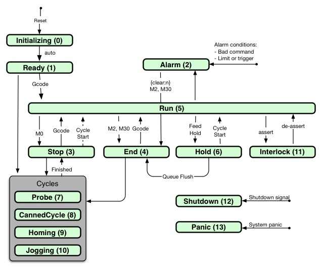

**PRELIMINARY - FOR DISCUSSION**<br><br>
These preliminary design pages are for discussion of the g2core REST interface: <br>

- [g2core REST Interface](g2core-REST-Interface)
- [g2core REST Resources](g2core-REST-Resources)
- [g2core REST Swagger](g2core-REST-Swagger)

---
# Resource Model Overview
Top level resources include:

- **Machine**: A composite resource describing the machine and its state
- **StatusReport**: An endpoint for getting status reports for reporting machine state
- **Operation**: Launch, monitor and control long-running machine actions or sets of actions
- **Job**: Launch, monitor and control sets of operations that define a complete "job" 

Planned in addition to the above: 

- **OperationMgr** resource that orchestrates operations and can be used to declaratively assemble jobs, or to build more interactive control structures for things like pick and place, pipetting, and applications where just sending a Gcode tape is inadequate.
- **JobMgr** resource that manages queues of jobs and scheduling

A top level view of resources follows with some more [resource details](#resource-details) provided at the and of this page

## Machine Resource
The machine resource exposes machine configuration and state, and is accessed via the [Machine REST endpoint](g2core-REST-Interface#machine).

Machine is a composite resource consisting of a hierarchy of resources that can be accessed individually. Examples include: axis and motor configurations; heater, spindle and coolant controls and feedback, board communications parameters; Gcode power-up defaults and Gcode coordinate system offset tables.

Resource attributes can be static or dynamic. Static attributes are used to configure the machine - like motor configuration settings. Dynamic resources report machine state, like motor power state (e.g. energized / not energized). Most state attributes (dynamic attributes) are read-only. State can be queried at any time, but is typically only of interest during Operations.

A top level view of the machine may include:

- Machine (root)

- Machine configuration (static):
  - Machine information
  - Communications parameters
  - Global machining parameters
  - Axis configurations
  - Motor configurations
  - Digital output configurations
  - Digital input configurations
  - Analog input configurations
  - Spindle configuration and state
  - Coolant configuration and state
  - Heater configuration and state
  - Gcode initialization defaults
  - Gcode offset tables (G54 - G59, G28, G30, G92)

- Machine state (dynamic):
  - [Gcode model state](g2core-REST-Interface#gcode-model-state)
  - POS: Motor position with offsets (work space)
  - MPO: Motor position in machine coordinates
  - OFS: Work space offsets
  - HOM: Homing state
  - PRB: Probing state
  - PWR: Motor power state (motor enables and power levels)
  - DO: Digital output state (current values of outputs / PWM levels)
  - DI: Digital input state (current values of inputs)
  - ADC: Analog input state (current values of inputs)
  - _xx: Diagnostic states

## Status_report Resource
Status reports are accessible via the status endpoint, accessing the g2core {sr:n} function with some additional tricks. Status reports are configured via the machine endpoint to set 'watches' on various dynamic attributes that are then collected into a single status report.

- A status report called with no 'value' in the body acts similarly to {sr:n}, the entire status report as configured is returned. This example returns:
  ```
{"line":3236,"posx":10.2318,"posy":-20.32,"posz":-2.755,"feed":1250,"vel":1203.33,"unit":1,"stat":5}
```

- A status report called with a null-valued attribute list in the body will return the values of just those attributes in the list. Example: 
  ```
{"posx":n,"posy":n,"posz":n,"vel":n,"stat":n} returns
{"posx":10.2318,"posy":-20.32,"posz":-2.755,"vel":1203.33,"stat":5}
```

- A status report called with a non-null-valued attribute list in the body will return the values of just those attributes in the list that are different from those submitted. Example: 
  ```
{"posx":10.2318,"posy":-20.32,"posz":-2.755,"vel":1203.33,"stat":5} returns
{"posx":11.4782,"posy":-19.022,"vel":1208.211}
```

## Operation Resource
The operation resource is a way to initiate and monitor a long-running function - for example a homing sequence or bed leveling tramming. An operation sets up a temporary context through which the caller can initiate an operation, receive status of operation progress, modify operation parameters, or abort the operation. 

- Operation ID: generated by the POST - may be used for later referral
- Operation body: the Gcode and/or JSON to be sent to the machine
- Operation state: the state variables monitored for that operation

Actions:<br>
- Initiate an operation<br>
  Send: `POST /operation` Post as text/plain with gcode or JSON command to be sent to board in the body<br>
  Retn: `operation ID`, e.g. 95. The response is just the id

- Query an operation<br>
  Send: `GET /operation/95` to fetch it's JSON state object<br>
  Retn: Operation state is returned as application/json

- Modify an operation<br>
  Send: `PUT /operation/95` to alter it's JSON state object<br>
  Retn: Operation state is returned as application/json

### Limitations
The following limitations are placed on this initial implementation:

- Operations are a single threaded - only a single operation can be active at a time. An operation must run to completion or be terminated to run another operation. This is not a big limitation as the current generation of machines can generally only run a single operation at a time. One place that would benefit from multi-threading is heaters - running a homing or bed tramming sequence while a heater is heating up. We solve this by breaking the heater cycle into 2 operations, first to set the target temperature and begin heating, second to wait until the heater is up-to-temp. Put homing and bed leveling in between these two. 

- There is no OperationsMgr declarative orchestration resource to to manage complex cycles. At the current time these are programmatic, such as pre-job sequencing and job queueing.

### Common Operations
Any Gcode or JSON sequence can be bundled as an operation, but here are the common ones:

- Jogging
- Run a job file
- Select tool / change tool
- Homing sequence - running one or more axes to limit switches
- Reset machine coordinates - set machine coordinates to arbitrary values
- Bed leveling tramming - consists of three probe actions followed by enabling tramming
- Probe sequence when performed outside of a Gcode program
- Spindle speed changes with delays / detection of speed changes

## Job Resource
The job resource is a specialized resource that can be submitted to an Operation to run a Gcode file. The Job resource provides the file, and can also contain other parameters that are useful for job setup and runtime.

_We need to decide what's in a job. I think this discovery is better done at coding time. It will become apparent what is needed. The job states are notional based on what we can do to a job and what we know about job processing._

- Job
  - Job state: PENDING, RUN, STOP, END, PAUSE, ABORT...
  - Job time
  - Overrides:
    - Feed rate override (on/off, factor)
    - Traverse rate override (on/off, factor)
    - Spindle speed override (on/off, factor)
    - Override coolant settings (manual coolant settings)

The dynamic machine state should be exposed via the Operator during the job operation.

# Resource Details
Note: the resource definition reflects the 0.99 firmware version. We have plans to make some changes such as breaking out the system resource in to smaller pieces, and adding attributes to some resources.
 
The 'Valid' column is a shorthand for guidance on type and validation metadata. Key and examples:

- type: (`f`)loat, (`i`)integer, (`e`)numeration, (`b`)oolean, (`s`)tring
- crud: `rw` (read/write), `ro` (read only), `wo` (write only), `ac` (active)
- valid: validation shorthand and notes:
  - `0-5` (valid range for ints or floats)
  - `0,1` (valid value list)
  - `0pos` - positive numbers including zero
  - `1pos` - positive numbers excluding zero (floats can be fractional)
  - Ints and floats w/o validation spec accept any number of that type
  - Booleans w/o validation spec accept: 't', 'f', 'true', 'false, '0', '1'
  - `tf` - only boolean true and false are valid; 0 and 1 not accepted
  - Enumerations are assumed to be validated to the numbers in their enumeration list; usually values from 0 to some max. In the future enumerations will also validate to the matching string for the enumeration, e.g. 'run' as a machine state enumeration. Not all enumeration validations are listed in the tables.

 
- example: f_rw_0-3.3 is a read/write float value valid from 0.0 to 3.3

Active attributes (ac) are read/write values that will invoke action if they are changed (PUT) from the API. Behaviors are defined on a case-by-case basis.


## System Resource
The system resource contains collections of attributes addressing:

- Machine identification
- Communications parameters
- Global machining parameters
- Gcode model initialization defaults
- Gcode model state
- Axis state

Currently these are all under the 'sys' resource; however they are listed in separate tables for clarity.

#### Machine Information
 
	Attribute | Key | Values | Notes
	------|------------|---------|-------------
	firmware_build | fb | f_ro |
	firmware_build_string | fbs | s_ro |
	firmware_build_config | fbc | s_ro |
	firmware_version | fv | f_ro |
	hardware_platform | hp | i_ro |
	hardware_version | hv | i_ro | Note: v8 boards allow setting this value 
	identification | id | s_ro |

#### Communications Parameters
 
	Attribute | Key | Values | Notes
	------|------------|---------|-------------
	enable_json | ej | e_rw_0-2 |
	json_verbosity | jv | e_rw_0-6 |
	text_verbosity | tv | e_rw_0-2 |
	status_report_verbosity | sv | e_rw_0-2 |
	status_report_interval | si | i_rw_0-2 |
 

-
- Global machining parameters
- Gcode model initialization defaults
- Gcode model state
- Axis state


- `{sys{...}}` - System Resource
  - `jt` - junction integration time (sets cornering velocity)
    - type: float
    - crud: read/write
    - valid: range 0.01 - 5.00
  - `ct` - chordal tolerance
    - type: float
    - crud: read/write
    - valid: positive non-zero
  - `sl` - soft limit enable
    - type: integer
    - crud: read/write
    - valid: 0/1
  - `lim` - limit enable
    - type: integer
    - crud: read/write
    - valid: 0/1
  - `saf` - safety interlock enable
    - type: integer
    - crud: read/write
    - valid: 0/1
  - `mt` - motor timeout
    - type: float (in seconds)
    - crud: read/write
    - valid: positive including zero
  - `m48e` - all override enable
    - type: integer
    - crud: read/write
    - valid: 0/1
  - `mfoe` - manual feedrate override enable
    - type: integer
    - crud: read/write
    - valid: 0/1
  - `mfo` - manual feedrate override factor
    - type: float
    - crud: read/write
    - valid: range 0.01 - 4.00
  - `mtoe` - manual traverse override enable
    - type: integer
    - crud: read/write
    - valid: 0/1
  - `mfoe` - manual feedrate override enable
    - type: integer
    - crud: read/write
    - valid: 0/1
  - `mfo` - manual feedrate override factor
    - type: float
    - crud: read/write
    - valid: range 0.01 - 1.00

#### Machine State Objects
All values are read-only

- `{ms{...}}` - Machine State Object
  - `n` - Model line number
  - `line` - Active line number - model or runtime line number
  - `vel` - current velocity
  - `feed` - current set feed rate
  - `stat` - combined machine state
  - `macs` - raw machine state
  - `cycs` - cycle state
  - `mots` - motion state
  - `hold` - feedhold state
  - `unit` - units mode
  - `coor` - active coordinate system
  - `momo` - motion mode
  - `plan` - plane select
  - `path` - path control mode
  - `dist` - distance mode
  - `admo` - arc distance mode
  - `frmo` - feed rate mode
  - `tool` - active tool
  - `g92e` - G92 enabled

- Axis State Objects - Ex: `{pos:{...}}`, or `{pos:{x:n}}` - `{pos:{c:n}}`
  - `pos` - position reported in work coordinates and prevailing units (read-only)
  - `mpo` - position reported in machine coordinates and millimeters (read-only)
  - `ofs` - work offsets reported in machine coordinates and millimeters (read-only)
  - `hom` - homing state (read-only)
  - `prb` - probe state (read-only)

### Gcode model state

	Attribute | JSON | Gcode | Notes
	------|------------|---------|-------------
	Running_state | {stat:n} | na | See diagram 
	Machine_state | {macs:n} | na | 
	Cycle_state | {cycs:n} | na |
	Motion_state | {mots:n} | na |
	Hold_state | {hold:n} | na |
	Line_number | {n:n} | N | line executing
	Line_number | {line:n} | N | line received
	Velocity | {vel:n} | na |
	Feed_rate | {feed:n} | F |
	Work_position | {pos:{x:n},...{c:n}} | na | See note
	Machine_position | {mpo:{x:n},...{c:n}} | na |
	Current_offsets | {ofs:{x:n},...{c:n}} | na |
	Homing_state | {hom:{e:n},{x:n},...{c:n}} | na |
	Probing_state | {prb:{x:n},...{c:n}} | na |
	Units | {unit:n} | G20, G21 |
	Coordinate_system | {coor:n} | G53...G59 |
	g92_offsets | {g92e:n} | G92 |
	Plane_select | {plan:n} | G17...G19 |
	Tool | {tool:n} | T | Active tool, not selected tool
	Path_control_mode | {path:n} | G61, G64 |
	Feed rate mode | {frmo:n} | |
	Distance_mode | {dist:n} | G90, G91 |
	Arc_distance_mode | {admo:n} | G90.1, G91.1 |

Note: All multi-axis properties are also available in "flat form", <br>
e.g. Position `{posx:n}, {posy:n}, {posz:n}, {posz:n}, {posb:n}, {posc:n}`

####Run State Transitions


### Actions
- Jog Object
  - `jog` - jog destination (read-write)


#### Motor Configuration Object

- `{1:{...}}` - motor configuration object
  - `ty` - motor type
    - type: enum
    - crud: read-only
    - notes: used to differentiate motor type - e.g. [0] step/dir, [1] hobbyservo, [2] trinamicXXXX
  - `ma` - map to axis
    - type: enum - x, y, z, a, b, c, u, v, w
    - crud: read/write
    - valid: available axes
  - `su` - steps-per-unit
    - type: float, prevailing units
    - crud: read/write
    - valid: positive non-zero
  - `sa` - step angle (read/write)
    - type: float, absolute units
    - crud: read/write
    - valid: positive non-zero
  - `tr` - travel per revolution
    - type: float, prevailing units
    - crud: read/write
    - valid: positive non-zero
  - `mi` - microsteps
    - type: integer
    - crud: read/write
    - valid: positive non-zero; non-standard values for the motor type are warned but accepted
  - `po` - polarity
    - type: integer
    - crud: read/write
    - valid: 0/1 only
  - `pm` - power mode
    - type: enum - [0] disabled, [1] always-powered, [2] powered-in-cycle, [3] powered-when-moving
    - crud: read/write
    - valid: enum
  - `pl` - power level
    - type: float
    - crud: read/write
    - valid: range 0.0 - 1.0 (full power)
  - `pi` - power level when idle
    - type: float
    - crud: read/write
    - valid: range 0.0 - 1.0 (full power)
  - `mt` - motor timeout (future)
    - type: float
    - crud: read/write
    - valid: positive including zero. A value of zero will use the global MT value

#### Axis Configuration Object

- `{x:{...}}` - axis configuration object
  - `am` - axis mode
    - type: enum - [0] disabled, [1] standard, [2] inhibited, [3] radius (ABC only)
    - crud: read/write
    - valid: enum
  - `vm` - velocity maximum
    - type: float
    - crud: read/write
    - valid: positive non-zero
  - `fr` - feed rate maximum
    - type: float
    - crud: read/write
    - valid: positive non-zero
  - `tn` - travel minimum
    - type: float
    - crud: read/write
    - valid: all floats
  - `tm` - travel maximum
    - type: float
    - crud: read/write
    - valid: all floats
  - `jm` - jerk maximum
    - type: float
    - crud: read/write
    - valid: positive non-zero
  - `jh` - jerk high speed
    - type: float
    - crud: read/write
    - valid: positive non-zero
  - `ra` - radius (rotary axes only)
    - type: float
    - crud: read/write
    - valid: positive non-zero
  - `hi` - homing input
    - type: integer
    - crud: read/write
    - valid: positive including zero (no input). Must be a valid DI or zero
  - `hd` - homing direction
    - type: enum - [0] search-to-negative, [1] search-to-positive 
    - crud: read/write
    - valid: enum
    - note: also sets whether "zero" is 0.000 or travel maximum
  - `sv` - search velocity
    - type: float
    - crud: read/write
    - valid: positive non-zero
    - note: will be limited to VM, but not checked on input
  - `lv` - latch velocity
    - type: float
    - crud: read/write
    - valid: positive non-zero
    - note: will be limited to VM, but not checked on input
  - `lb` - latch backoff
    - type: float
    - crud: read/write
    - valid: positive non-zero
  - `zb` - zero backoff
    - type: float
    - crud: read/write
    - valid: positive non-zero

#### Coordinate System Offsets (G10)
These objects expose Gcode coordinate offsets (G10) as JSON objects.

- `{g54:{x:n,y:n,z:n,a:n,b:n,c:n}}` - Coordinate system offsets 1 (G54)
- `{g55:{x:n,y:n,z:n,a:n,b:n,c:n}}` - Coordinate system offsets 2 (G55)
- `{g56:{x:n,y:n,z:n,a:n,b:n,c:n}}` - Coordinate system offsets 3 (G56)
- `{g57:{x:n,y:n,z:n,a:n,b:n,c:n}}` - Coordinate system offsets 4 (G57)
- `{g58:{x:n,y:n,z:n,a:n,b:n,c:n}}` - Coordinate system offsets 5 (G58)
- `{g59:{x:n,y:n,z:n,a:n,b:n,c:n}}` - Coordinate system offsets 6 (G59)
- `{g92:{x:n,y:n,z:n,a:n,b:n,c:n}}` - Temporary coordinate offsets
- `{g28:{x:n,y:n,z:n,a:n,b:n,c:n}}` - G28 position (Read only)
- `{g30:{x:n,y:n,z:n,a:n,b:n,c:n}}` - G30 position (Read only)

###Digital IO Objects
#### Digital Input Objects
Note that the pre fb100 releases are different that the below. See here for [pre-fb100 digital inputs](https://github.com/synthetos/g2/wiki/Digital-IO-(GPIO)). The fb100 builds adopt some of the changes described in the [GPIO design discussion](https://github.com/synthetos/g2_private/wiki/GPIO-Design-Discussion). As below:

- `{diN:{...}}` - digital input configuration object
  - `mo` - mode
    - type: enum - [0] disabled, [1] enabled
    - crud: read/write
    - valid: enum (0/1)
    - note: Mode will return NULL if an input is queried that is not available due to hardware or configuration
  - `po` - polarity
    - type: enum - [0] normal (active-high), [1] inverted (active-low)
    - crud: read/write
    - valid: enum (0/1)
  - `ac` - action
    - type: enum - [0] none, [1] stop, [2] fast-stop, [3] halt, [4] cycle-start, [5] alarm, [6] shutdown, [7] panic, [8] reset 
    - crud: read/write
    - valid: enum
  - `in` - binding to inM object
    - type: integer - 0=no-binding, 1-M = bound to in1 to inM
    - crud: read/write
    - valid: zero and any valid digital input
    - note: M is limited to 32
  - `fn` - function
    - type: enum - 0=none, 1=limit, 2=interlock, 3=shutdown
    - crud: read/write
    - valid: enum
    - note: This method of function binding will be removed in future releases and replaced with a "downward binding" from the function to the DI.

- `{in:{...}}` - digital input readout object
    - type: integer; 0=inactive, 1=active
    - crud: read-only

#### Digital Output Objects
Note that the pre fb100 releases are different that the below. See here for [pre-fb100 digital inputs](https://github.com/synthetos/g2/wiki/Digital-IO-(GPIO)). The fb100 builds adopt some of the changes described in the [GPIO design discussion](https://github.com/synthetos/g2_private/wiki/GPIO-Design-Discussion). As below:

- `{doN:{...}}` - digital input configuration object
  - `mo` - mode
    - type: enum - [0] disabled, [1] enabled
    - crud: read/write
    - valid: enum (0/1)
    - note: Mode will return NULL if an output is queried that is not available due to hardware or configuration
  - `po` - polarity
    - type: enum - [0] normal (active-high), [1] inverted (active-low)
    - crud: read/write
    - valid: enum (0/1)

- `{out:{...}}` - digital output readout object
    - type: integer; 0=inactive, 1=active
    - crud: read-only

#### PWM Configuration Objects
These are legacy and will be folded into the digital output objects later. Details are not yet provided.

- `{pN:{...}}` - PWM configuration object.
  - `frq` - frequency
  - `csl` - clockwise speed low
  - `csh` - clockwise speed high
  - `cpl` - clockwise phase low
  - `cph` - clockwise phase high
  - `wsl` - counter-clockwise speed low
  - `wsh` - counter-clockwise speed high
  - `wpl` - counter-clockwise phase low
  - `wph` - counter-clockwise phase high
  - `pof` - phase off

#### PID Configuration Objects
These are legacy and will be folded into the digital output objects later. Details are not yet provided.

- `{pidN:{...}}` - PID configuration object
  - `p` - position
  - `i` - integral
  - `d` - derivative

#### Heater Objects
Note that this object also contains mostly configuration but also some state information. This object is legacy and will probably be revised.

- `{heN:{...}}` - Heater object
  - `e` - enable
  - `p` - position
  - `i` - integral
  - `d` - derivative
  - `st` - set temperature
  - `t` - get temperature
  - `op` - heater output (RO)
  - `tr` - thermistor resistance (RO)
  - `at` - at temperature (RO)
  - `an` - heater adc (RO)
  - `fp` - fan power
  - `fm` - fan min power
  - `fl` - fan low temperature
  - `fh` - fan high temperature


#____________________________
#____________________________
# Job Interface (OLD STUFF)
Listing the functions we need:

- Host Functions
  - [1] Setup communications (e.g. setup wifi, ethernet)

- Machine Setup
  - [1] View/Set user level machine configuration
  - [2] Save/Restore user level machine configuration
  - [1] View/Set deep machine configuration
  - [2] Save/Restore deep machine configuration
  - [1] Jog tool
  - [1] Tram bed
  - [1] Set zero
  - [2] Set work coordinate offsets and other offsets 
  - [2] Change tool / toolhead
  - [2] Turn spindle on/off/speed
  - [2] Turn coolant on/off

- Job Setup
  - [1] Get / open file
  - [2] View file (preview)
  - [1] Run job preamble (e.g. heaters, zeroing)

- Job Control
  - [1] Start job
  - [1] Pause/resume job
  - [2] Overrides
    - Feed rate
    - Spindle speed
    - Coolant on/off
  - [1] Job Progress / Status
    - [1] Position (DRO)
    - [1] Temperature
    - Time in job / time remaining
    - Graphical display